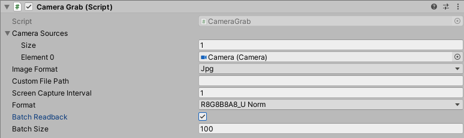

# Overview
The Simulation Capture SDK is a set of classes that facilitate the capture of various data sources, such as textures, cameras, logs, etc. and uploading them to the cloud.

Some of these resources can be tricky to get from the player in a performant manner, without impacting the performance of the player itself. This SDK aims to provide methods to access and archive this data with minimal performance impact to the player.

The design of the SDK is asynchronous in nature. The capture methods will execute immediately, returning a request object that can be queried for completion or error status. These requests generally execute in the background on the system threadpool.

In some cases, where there is no support for capturing something in an asynchronous manner, part or all of the capture request may be performed synchronously. In these cases, the request will be marked completed before it is returned to the caller.

Add CameraGrab script component to the gameobject

## CaptureCamera

- Camera Sources : Cameras for which readback is to be performed at specified Screen Capture interval.
- Graphics Format : Color pixel format to capture
- Batch Readback : Perform camera capture in batches. With this enabled, capture requests will be queued and performed in batch when the number of reuqests reaches the size of the batch. 
