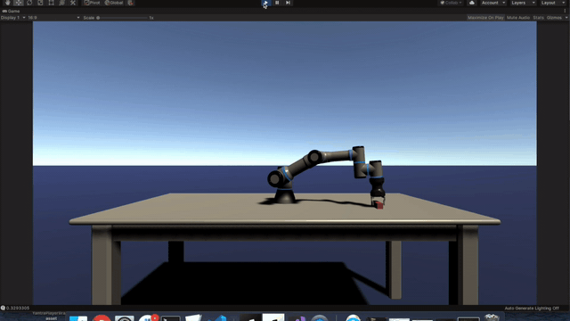

# Unity Robotics Demos

The recent integration of [Nvidia's PhysX 4](https://news.developer.nvidia.com/announcing-physx-sdk-4-0-an-open-source-physics-engine/) into Unity has dramatically improved the quality of robotics simulation that is possible in Unity. 

* The new articulation joint system (available in 2020.1) is much better suited to building things like robot arms than the older joint types available in Unity. It uses Featherstone's algorithm and a reduced coordinate representation to gaurantee no unwanted stretch in the joints. In practice, this means that we can now chain many joints in a row and still achieve stable and precise movement. 

* The new [Temporal Gauss Seidel (TGS) solver](Temporal Gauss Seidel) also supports more accurate simulation. 

## Installation

Unity 2020.10b1 or later is needed for the new joint system. 

#### Install Unity

If you do not have Unity 2020.1.0b1 or later, add the latest 2020.1 beta release
through [Unity Hub](https://unity3d.com/get-unity/download). This demo has been
last tested on Unity 2020.1.0b5.

#### Clone the Articulations Robot Demo Repo

Clone this repository:
```sh
git clone https://github.com/Unity-Technologies/articulations-robot-demo.git`
```

## UR3 Robot Arm



This is a simulation of the [Universal Robotics UR3e](https://www.universal-robots.com/products/ur3-robot/) robot using Unity's new [articulation joint system](https://docs.unity3d.com/2020.1/Documentation/ScriptReference/ArticulationBody.html).

Open `Scenes` > `ArticulationRobot`, and press play.

#### Manual Controls

You can move the robot around manually using the following keyboard commands:

```
A/D - rotate base joint
S/W - rotate shoulder joint
Q/E - rotate elbow joint
O/P - rotate wrist1
K/L - rotate wrist2
N/M - rotate wrist3
V/B - rotate hand
X - close pincher
Z - open pincher
```

All manual control is handled through the scripts on the `ManualInput` object. To disable
manual input, just uncheck this object in the Hierarchy window.


## Robotek Hand-E Gripper 

This simulation focuses on picking up different objects with the [Robotek Hand-E Gripper](https://robotiq.com/products/hand-e-adaptive-robot-gripper).

Open `Scenes` > `GripperScene`, and press play. Try to pick up the cube and drop it!

#### Manual Controls

Use the following keyboard commands:

```
G - down
H - up
X - close pinhcer
Z - open pincher
```


## License

[Apache License 2.0](LICENSE)


