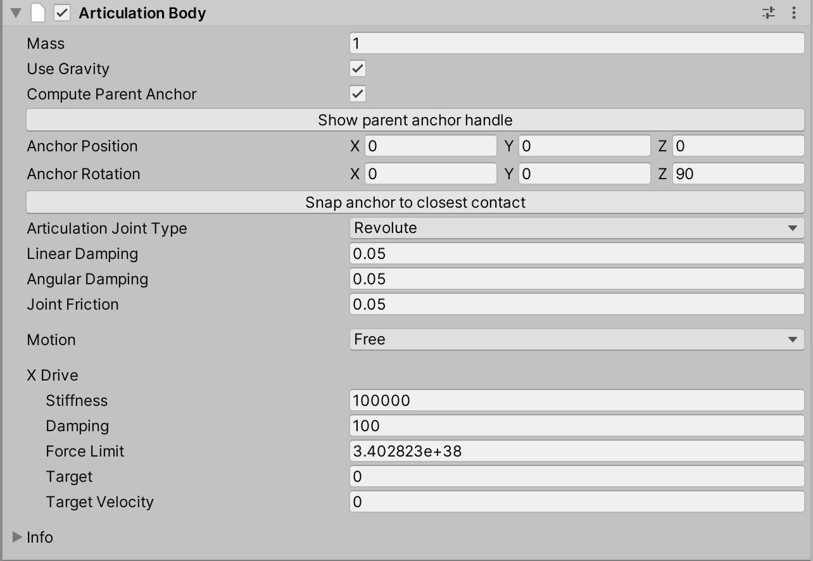

# Articulations Robot Demo


This is a simulation of the [Universal Robotics UR3e](https://www.universal-robots.com/products/ur3-robot/) robot using Unity's new [articulation joint system](https://docs.unity3d.com/2020.1/Documentation/ScriptReference/ArticulationBody.html).

This new joint system, powered by [Nvidia's PhysX 4](https://news.developer.nvidia.com/announcing-physx-sdk-4-0-an-open-source-physics-engine/), is a dramatic improvement over the older joint types available in Unity. It uses Featherstone's algorithm and a reduced coordinate representation to gaurantee no unwanted stretch in the joints. In practice, this means that we can now chain many joints in a row and still achieve stable and precise movement. 


## Getting Started

Requires `2020.1.0b1` build of Unity or later. To get started:
1. Open the `ArmRobot` folder in Unity.
2. Open `Scenes` > `ArticulationRobot`
3. Press play

## Manual Controls

You can move the robot around manually using the following keyboard commands:

```
A/D - rotate base joint
S/W - rotate shoulder joint
Q/E - rotate elbow joint
O/P - rotate wrist1
K/L - rotate wrist2
N/M - rotate wrist3
V/B - rotate hand
X - close pincher
Z - open pincher
```

All manual control is handled through the scripts on the `ManualInput` object. To disable
manual input, just uncheck this object in the Hierarchy window.

## Building with Articulations

When building a robot arm with articulation joints, each movable part of the robot should be a child of the previous part. You can see these successive parent-child relationships by expanding the `UR3` object in the Hierarchy window. 


Next, you must add an `ArticulationBody` component to each of the game objects that compose the robot arm. You will not need to add `Rigidbody` components to any parts of the robot arm, but you may still want to add them to other objects in the environment that the robot will interact with. In our example, there are `Rigidbody`s only on the cube and the table. 

If you examine the `ArticulationBody` component on the base of the robot (the `UR3` game object), you will notice that it has a very simple interface. The is the root body of the articulation, which plays a special role. The `immovable` property should be checked if you do not intend this part of the robot to move around.


The successive `ArticulationBody` components on your robot arm are much more customizable. The most important setting here is `Articulation Joint Type`. The available types are:
* Fixed - does not allow any relative movement of the connected bodies
* Prismatic - only allows relative translation of the connection bodies along one specified axis
* Revolute - allows rotational movement around the X axis of the parent's anchor
* Spherical - allows relative rotations (but not translations) of the two connected bodies




## License

[Apache License 2.0](LICENSE)


