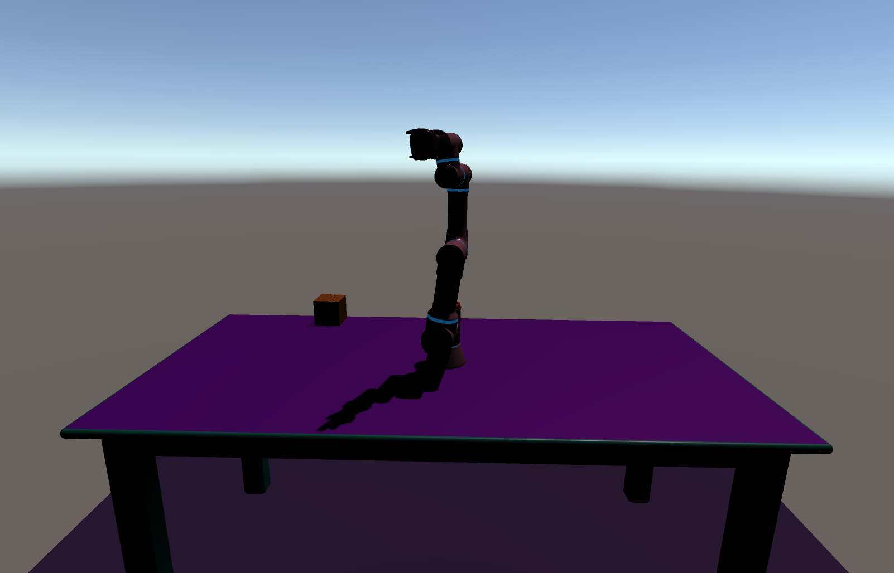
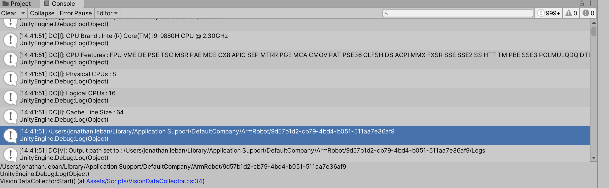

# Single Cube Environment 

In this branch, we set up an environment with a [Universal Robotics UR3e](https://www.universal-robots.com/products/ur3-robot/) robot on a table along with a cube. 

Open `Scenes` > `ArticulationRobot`.

## Purpose of the Scene 
This scene has been set up to predict the coordonates of the center of the cube in order to feed some algorithm as a Neural Network. The idea behind is to train neural network only using simulated data instead of real data. Nevertheless, the neural network will be then applied on real data. The focus is hence to decrease the reality gap as much as possible which is the difference between the simulated and the real worl. Domain randomization is one of the many techniques enabling to reduce the reality gap. Instead of training a model only on one simulator, we randomize the simulator to expose the model to multiple different environments during training time. 

Below is the list of element we randomize:
- The number of source lights  
- The direction, the position and the intensity of the light for the source lights
- The position and the texture of the cube 
- The position of the robot  
- The position, orientation and field of view of the camera 
- The texture of the table and the robot 

The domain randomization process is controlled by the script `DomainRandomization.cs` under `Assets` > `Scripts`

## Glimpse into the code 
The orchestror file is `Robot` > `RobotVisionCapture.cs`. In this file, at each frame, we extract the position of the cube relative to the camera and we create a datapoint object which is the vector of data we want to extract (see `Robot` > `RobotVisionDataPoint.cs`). Then, we capture the image of the mainCamera and we load the image and the datapoint. We do these two actions in when we call the `CaptureIfNeccessary` method inside `VisionDataCollector.cs` file. Then, if we didn't reach the number of simulated data we want to extract, we repeat the process but we need to change the environment of the data by performing domain randomization. This is done in the `Reset` method. 

Inside `DomainRandomization.cs`, we need to move the robot and the cube. We distinguish their motion as they are completely different objects. 
For the robot, I create a method `MoveRobot` which calls the method `ForceJointsToRotation` inside the `RobotController.cs` file. This method forces the joints of the robot to move. 
For the cube, I call the `Move` method from the `RandomizerPositionObject.cs` file. To generate a new position of the cube, I pick a random point between a square of edge minRobotReach and a square of edge maxRobotReach. This is the area where the robot can reach the object and perform task on it. I also change the orientation of the cube. 

For the other elements which are randomized, follow the code inside `DomainRandomization.cs` and go to the corresponding files to understand how it is done. 

## Run Simulation 
Open `Scenes` > `ArticulationRobot`, and press play. To control the number of data you want to extract, you need to change the value of variable `Max Samples` in the inspector of the `VisionDataCollector` game object. Then, when you press start and the ismulation is over, if you go to the log, you can see the path on your computer where the data was loaded. 

Then, there is two folders inside the data folder: Logs and ScreenCapture. The ScreenCapture folder gathers all the images captured by the mainCanera object whereas Logs gathers all the datapoints inside txt files. 

## Survey

Your opinion matters a great deal to us. Only by hearing your thoughts can we continue to make Unity a better simulator for robotics. Please take a few minutes to let us know about it.

[Fill out the survey](https://docs.google.com/forms/d/e/1FAIpQLSc77ah4azt6D4AOxCWhjpCBgM6Si6f0DA_dunM-ZhDf5xJlgg/viewform)

## License

[Apache License 2.0](LICENSE)

