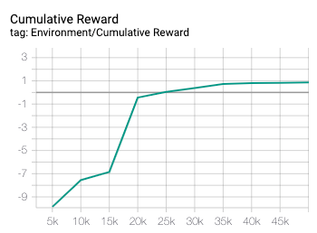

# Training the UR3 with MLAgents

A simulation of the Universal Robotics UR3 robot with articulation joints.

Requires 2020.1.0b1 build of Unity or later.

Open the `ArmRobot` folder in Unity.

Open `Scenes` > `ArticulationRobot` and press play.

## Manual Controls

All manual control is handled through the scripts on the `ManualInput` object. To enable
manual input, just check this object in the Hierarchy window, and uncheck the `MLAgents` object.

```
A/D - rotate base joint
S/W - rotate shoulder joint
Q/E - rotate elbow joint
O/P - rotate wrist1
K/L - rotate wrist2
N/M - rotate wrist3
V/B - rotate hand
X - close pincher
Z - open pincher

space - instant reset
```

## MLAgents

In this project, we used MLAgents to train the robot to touch the cube. 

The agent controls the robot at the level of its six joints in a discrete manner. It uses a 'joint index' to select the joint, and an 'action index' to move that joint clockwise, counterclockwise, or not at all. For state, the agent is given the current rotation of all six joints and the position of the cube.

The reward at each step is simply the negative distance between the end effector and the cube. The advantage of this is that changes in reward are continuous and it does incentivize the agent to pursue our goal of touching the cube. However, other reward schemes may work as well or better. You should experiment!

The episodes end immediately when the robot touches the cube, and are limited to a maximum of 500 steps. At the beginning of each new episode, the robot is reset to its base pose, and the cube is moved to a random location on the table.

#### Install 

If you have MLAgents errors upon opening the project, uninstall MLAgents (look under `Window` > `Package Manager`), then reinstall as shown below.

1. Download MLAgents 0.15.0 from Github with: `git clone https://github.com/Unity-Technologies/ml-agents.git`
2. Navigate into that folder and run `git checkout release-0.15.0`
2. To add MLAgents to the Unity project:
     a. Go to `Window` > `Package Manager`
     b. Select the plus button in the upper left corner, and then `add package from disk`
     c. Navigate to the MLAgents project you just cloned, and within that select `com.unity.ml-agents` > `package.json`
3. Install the corresponding MLAgents python package with `pip3 install mlagents==0.15.0`

#### Train

To start training, just run this command:

`mlagents-learn config.yaml --run-id=[YOUR RUN ID] --train`

Then, press `play` in Unity.

As the training runs, a `models` and a `summaries` folder will be automatically created in the root level of this project. As you might guess, the `models` folder stores the trained model files, and the `summaries` folder stores the event files where Tensorflow writes logs.

To monitor training, navigate into the `summaries` folder and run:

`tensorboard --logdir=[YOUR RUN ID]_TouchCube`

You can then view the live Tensorboard at `localhost:6006`. 

#### Our Results

Since there is some randomness in the training process, your results might not look exactly like ours. Our reward gradually increased during training, as expected:



Since the reward was quite noisy, we used heavy smoothing in this graph to more easily see the trend. Tensorboard makes this easy, and you might want to try the same. 

## License

[Apache License 2.0](LICENSE)
